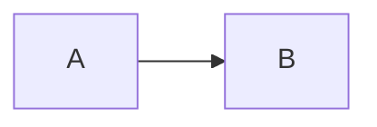

# Mermaid Diagrams

Renders fenced `mermaid` code blocks in PI WEB chat messages as Mermaid diagrams.



Rendered diagrams include a width slider from 50% to 200%. Increase the width to make a wide chart easier to read and scroll horizontally, or decrease it to fit more of the chart on screen.

The plugin loads Mermaid 11.16.0 from jsDelivr in the browser. A failed render leaves the original code block visible and logs `mermaid.render.failed` in the browser console.

The stable PI WEB plugin API has no chat-renderer hook, so this plugin watches the current internal `<formatted-text>` chat element and its code-block markup.

Enable it by linking this plugin into the PI WEB plugin directory:

```bash
mkdir -p ~/.pi-web/plugins
ln -sfn "$PWD/pi-web-plugins/mermaid" ~/.pi-web/plugins/mermaid
```

Hard reload PI WEB after enabling or changing the plugin.
